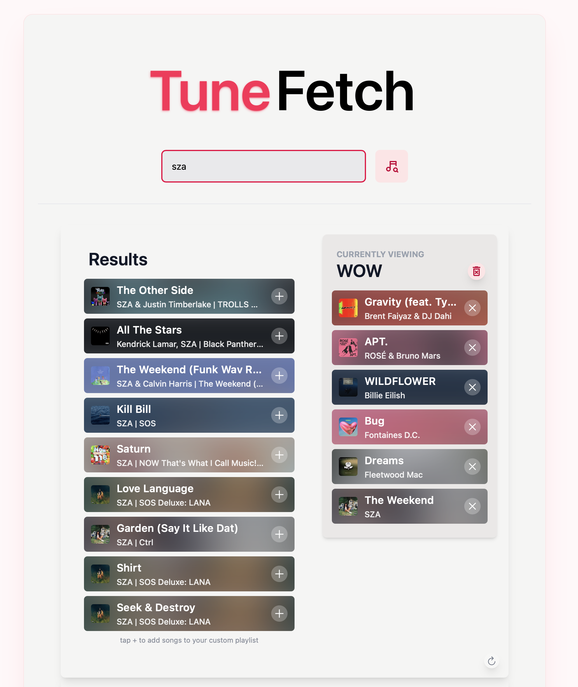
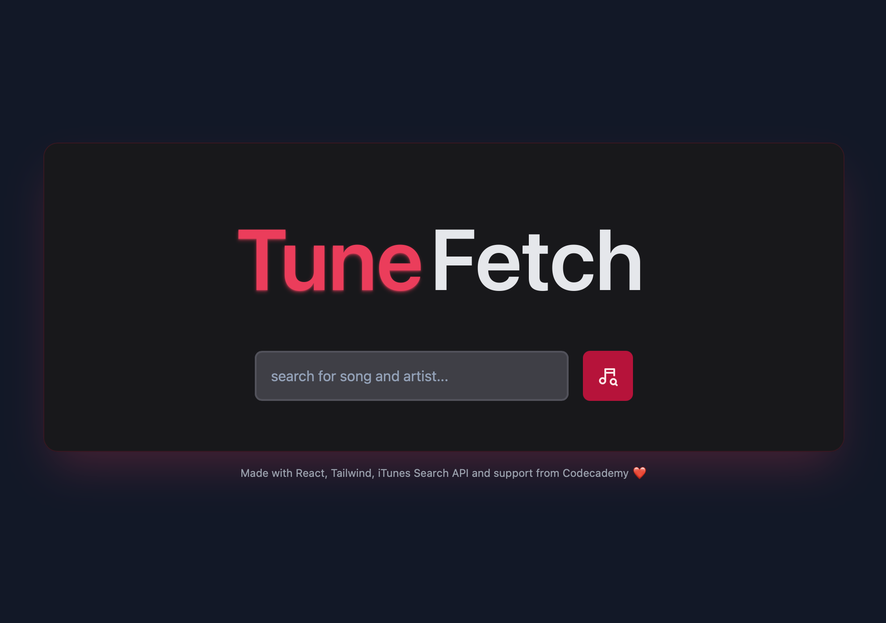
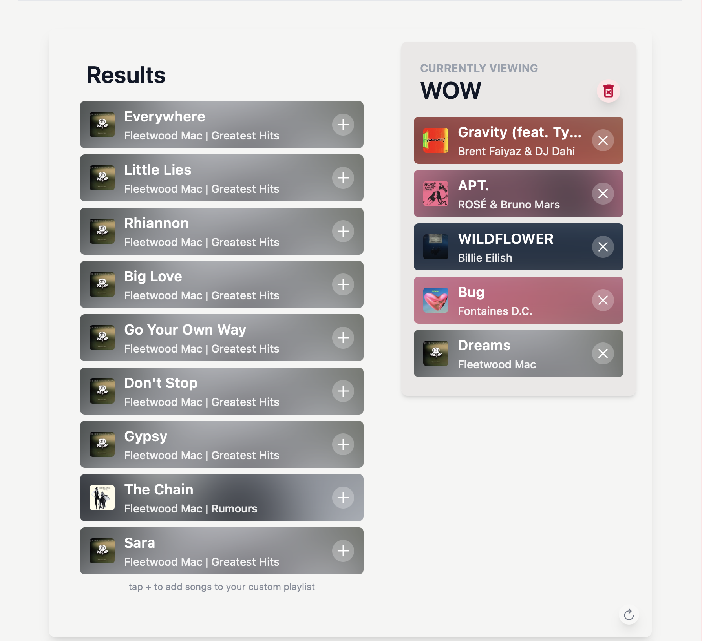
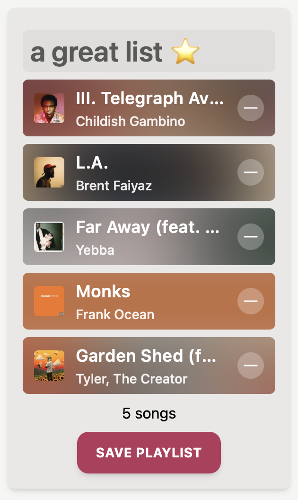
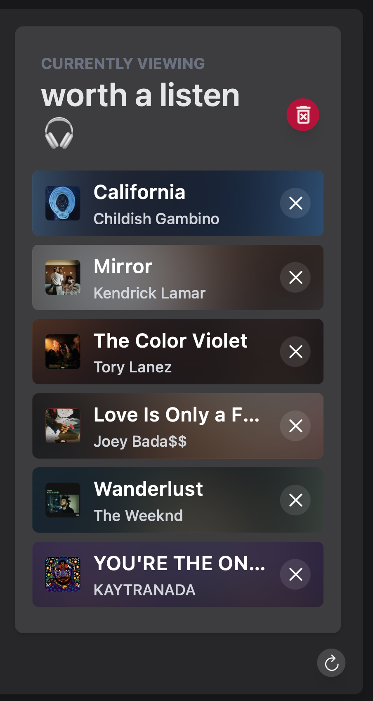
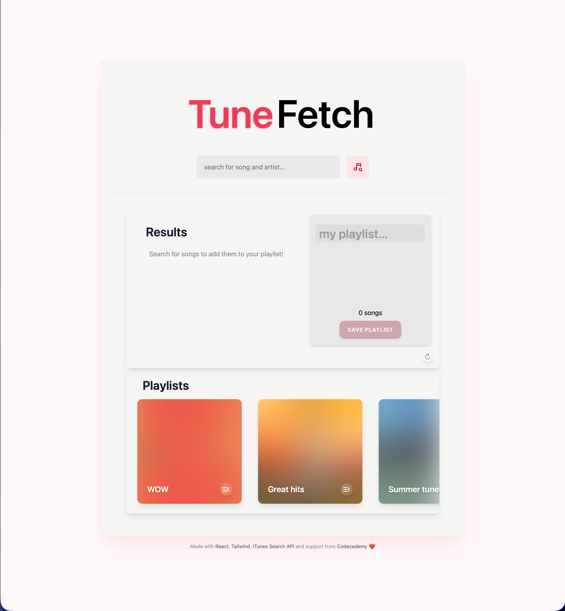
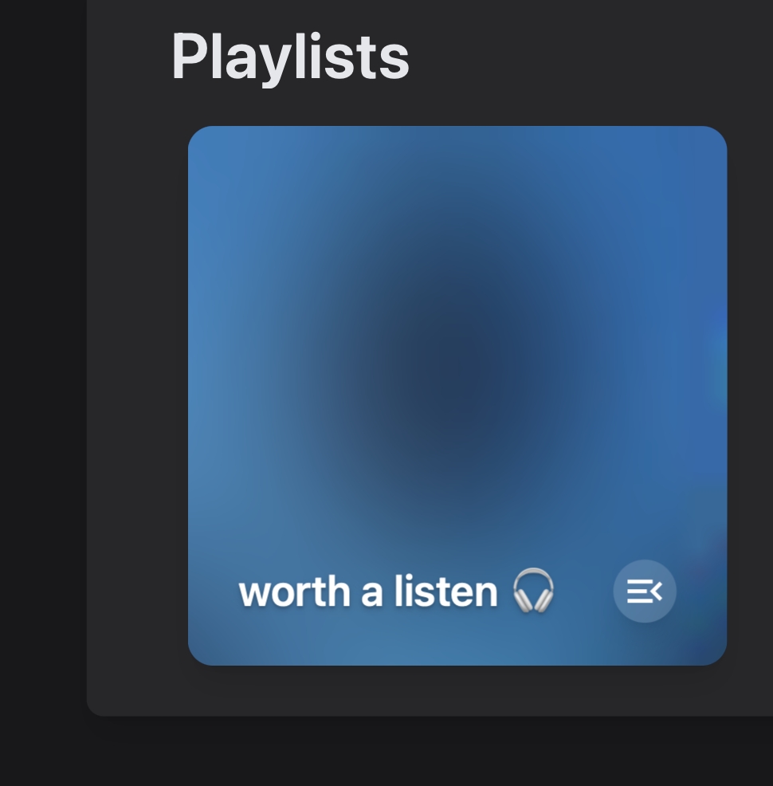

# 🎧 TuneFetch

A sleek, responsive music playlist web app prototype built with React, Tailwind and the iTunes Search API. Search for songs, create custom playlists, modify your collection and save them to your TuneFetch dashboard.

This is a Codecademy project from the Full-Stack Engineer Career Path.

 

---

## 🚀 Features

- 🔍 Search for songs, albums, and artists using the iTunes Search API
- 🎶 Create, edit, and view custom playlists
- ➕ Add or remove tracks to custom playlists
- 🟣 Album artworks create subtle backgrounds for tracks and playlist covers
- 💾 Save playlists to your TuneFetch dashboard
- 🌓 Automatic light/dark mode based on device preferences
- ⚠️ Error handling and pop-ups
- 📱 Fullscreen desktop view

This app is only a 'prototype' and serves as an entry project in my dev journey 😉

---

## 🛠 Tech Stack

- **Frontend**: React, Javascript, Tailwind CSS, Vite
- **API**: iTunes Search API
- **Icons**: React Icons

---

## 📸 Screenshots

---

## 🌍 Try it out!

[TuneFetch](https://tunefetch.netlify.app)
